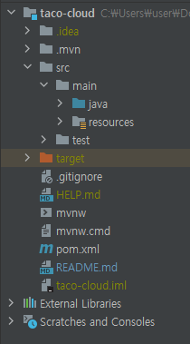
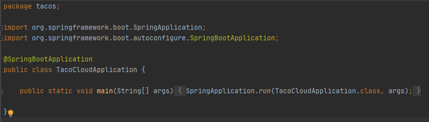

# Spring in Action

## 1. 스프링 시작하기
### 스프링이란?
스프링 애플리케이션 컨텍스트라는 컨테이너를 제공하고 이는 애플리케이션 컴포넌트들을 생성하고 관리  
애플리케이션 컴포넌트 또는 bean(빈)들은 스프링 애플리케이션 컨택스트 내부에서 서로 연결되어 완전한 애플리케이션 생성  
bean의 상호 연결은 의존성 주입 Dependency Injection(DI)라고 알려진 패턴을 기반으로 수행  
애플리케이션 컴포넌트에서 의존하는 다른 bean의 생성과 관리를 자체적으로 하는 대신 별도의 개체(컨테이너)가 대신 수행  

어노테이션을 이용해 다양한 동작을 할 수 있음
```
어노테이션이란 ?
클래스, 인터페이스, 함수, 매개변수, 속성, 생성자에 어떤 의미를 추가할 수 있는 기능
자바 컴파일러가 컴파일 시 처리하며 소스 코드에 추가된 어노테이션 자체는 바이트코드로 생성되지 않고 주석 처리되지만
가지는 의미는 컴파일러가 수행 @로 시작
```

스프링에서는 자동-구성 기능을 제공  
자동-구성 기능이랑 자동 연결과 컴포넌트 검색이라는 스프링 기법으로 컴포넌트 검색을 사용해 스프링은 자동으로 애플리케이션의 classpath에 지정된 컴포넌트를 찾은 후  
스프링 애플리케이션 컨텍스트의 빈으로 생성  
자동 연결을 사용하여 의존 관계에 있는 컴포넌트를 자동으로 다른 bean에 주입

### 스프링 프로젝트 만들기
스프링 프로젝트를 만들기 위해서는 아래와 같은 방법들이 있음
- https://start.spring.io에서 생성
- command line에서 curl 명령 이용
- command line에서 sprind CLI 사용
- Spring Tool Suite IDE를 이용해 새로운 프로젝트 생성
- IntelliJ IDEA IDE를 사용해 새로운 프로젝트 생성
- NetBeans IDE를 사용해 새로운 프로젝트 생성

### 스프링 프로젝트 구조
스프링은 Maven, Gradle 구조를 이용해 만들 수 있는데 여기서는 Maven을 이용하도록 한다
```
Maven은 Spring에서 라이브러리를 관리해주며 의존성이 있는 라이브러리들까지 함께 다운로드 해주며 추가로 프로젝트의 전체적인 life cycle까지 관리한다
Gradle는 빌드 배포 도구로 스크립트 언어로 구성되어 있어 if, else등의 로직 구현이 가능하며, Maven과 마찬가지로 라이브러리 관리 및 프로젝트를 관리해준다
Maven은 pom.xml, Gradle는 .gradle 파일로 관리
```

프로젝트를 생성하게 되면 위와 같은 형식으로 디렉토리가 생성되는데 하나하나 살펴보도록 하자.  

##### /src/main/java
애플리케이션의 소스코드가 저장되는 곳으로 대부분의 작업이 여기서 진행
##### /src/test/java
테스트 코드가 저장되는 곳
##### /src/main/resource
이미지나 html파일 같은 것들이 저장되는 곳
##### pom.xml
Maven을 사용하면 생성되는 파일로 library 들을 관리  
프로젝트를 생성할때 사용하겠다고 한 library 관련 내용들이 이미 들어가 있음  
##### application.prorerties  
구성 속성을 지정하여 사용 5장에서 자세하게 다룸  

스프링 프로젝트를 실행시키려면 어떻게 해야할까

/src/main/java/tacos 에 TacoCloudApplication.java 파일이 존재하는데 이 파일을 열어 실행시키면 Spring 프로젝트를 실행시킬 수 있는데  
이는 @SpringBootApplication 어노테이션이 지정되어 있기 때문
여기서 Spring 프로젝트를 실행시키면 내장된 tomcat과 연동되어 default localhost:8080으로 접근하면 프로젝트 페이지를 볼 수 있음  

### 스프링 애플리케이션 작성하기
스프링은 MVC 패턴에 따라 동작하는데 이를 위해서 아래 controller과 view template이 필요하다
웹 요청을 처리하기 위한 Controller 클래스는 아래와 같음
```java
package tacos;

import org.springframework.stereotype.Controller;
import org.springframework.web.bind.annotation.GetMapping;

@Controller
public class HomeController {

    @GetMapping("/")
    public String home() {
        return "home";
    }
}
```
위의 코드에서 @Controller 어노테이션이 해당 method가 Controller 역할을 한다는 것을 알려주며  
@GetMapping("/") 부분은 웹페이지에서 요청이 들어오는 경우 /에 해당하는 요청을 처리한다는 것을 뜻한다  
현재 Spring Project에 접근하기 위한 기본 URL은 localhost:8080으로 해당 페이지에 접근하는 경우 home이 return된다  
그렇다면 home는 무엇을 나타낼까  
home이 바로 home.html View를 말하는데 /src/main/resource/templates/home.html 을 만들어 작성하면 localhost:8080 에 접근하여 보이는 페이지가 된다
